# OVERALL SYSTEM ARCHITECTURE

```mermaid
flowchart TB

    %% =========================
    %% CLIENTS
    %% =========================
    subgraph CLIENTS["Clients"]
        DISCORD_USER["Discord Users"]
        ADMIN["Admin / Moderator"]
    end

    %% =========================
    %% PRESENTATION / DISCORD
    %% =========================
    subgraph PRESENTATION["Presentation Layer"]
        DISCORD["Discord Bot<br/>discord.js + TypeScript"]

        COMMANDS["Slash Commands"]
        COMPONENTS["Buttons / Select Menus / Modals"]
        EVENTS["Discord Event Handlers"]

        COMMANDS --> DISCORD
        COMPONENTS --> DISCORD
        EVENTS --> DISCORD
    end

    %% =========================
    %% APPLICATION
    %% =========================
    subgraph APPLICATION["Application Layer"]

        ROUTER["Command / Interaction Router"]

        AUTH["Authorization"]
        RATE_LIMIT["Rate Limits / Cooldowns"]
        IDEMPOTENCY["Idempotency Checks"]

        CARD_APP["Card Queries"]
        COLLECTION_APP["Collection"]
        BINDER_APP["Binder"]
        PACK_APP["Pack Opening"]
        ECONOMY_APP["Economy"]
        MARKET_APP["Marketplace"]
        TRADE_APP["Trading"]
        REWARD_APP["Rewards / Achievements"]
        PROFILE_APP["Player Profile"]
    end

    %% =========================
    %% DOMAIN
    %% =========================
    subgraph DOMAIN["Domain Layer"]

        CARD["Card Domain"]
        PACK["Pack Domain"]
        COLLECTION["Collection Domain"]
        BINDER["Binder Domain"]
        ECONOMY["Economy Domain"]
        MARKET["Marketplace Domain"]
        TRADE["Trading Domain"]
        PROGRESSION["Progression Domain"]

        RNG["Secure RNG / Drop Logic"]
        OWNERSHIP["Ownership Rules"]
        TRANSACTIONS["Transaction Rules"]
    end

    %% =========================
    %% PORTS
    %% =========================
    subgraph PORTS["Domain Ports / Interfaces"]

        REPOSITORIES["Repository Interfaces"]
        EVENT_PUBLISHER["Event Publisher Interface"]
        CLOCK["Clock / Time Interface"]
    end

    %% =========================
    %% INFRASTRUCTURE
    %% =========================
    subgraph INFRA["Infrastructure Layer"]

        POSTGRES[(PostgreSQL)]
        REDIS[(Redis)]

        OUTBOX["Transactional Outbox"]
        OUTBOX_WORKER["Outbox Worker"]

        CARD_SYNC["Card / Set Sync Worker"]
        PRICE_SYNC["Price Sync Worker"]

        TCG_CLIENT["Pokémon TCG API Client"]
        PRICE_CLIENT["Pricing Provider Client"]

        OBJECT_STORAGE["Object Storage / CDN"]

        LOGGING["Logging / Observability"]
    end

    %% =========================
    %% EXTERNAL
    %% =========================
    subgraph EXTERNAL["External Services"]

        PTCG["Pokémon TCG API"]
        PRICE["Pricing Providers"]
    end

    %% =========================
    %% CLIENT FLOW
    %% =========================

    DISCORD_USER --> COMMANDS
    DISCORD_USER --> COMPONENTS
    ADMIN --> COMMANDS

    DISCORD --> ROUTER

    ROUTER --> AUTH
    AUTH --> RATE_LIMIT
    RATE_LIMIT --> IDEMPOTENCY

    IDEMPOTENCY --> CARD_APP
    IDEMPOTENCY --> COLLECTION_APP
    IDEMPOTENCY --> BINDER_APP
    IDEMPOTENCY --> PACK_APP
    IDEMPOTENCY --> ECONOMY_APP
    IDEMPOTENCY --> MARKET_APP
    IDEMPOTENCY --> TRADE_APP
    IDEMPOTENCY --> REWARD_APP
    IDEMPOTENCY --> PROFILE_APP

    %% =========================
    %% APPLICATION → DOMAIN
    %% =========================

    CARD_APP --> CARD
    COLLECTION_APP --> COLLECTION
    BINDER_APP --> BINDER
    PACK_APP --> PACK
    ECONOMY_APP --> ECONOMY
    MARKET_APP --> MARKET
    TRADE_APP --> TRADE
    REWARD_APP --> PROGRESSION
    PROFILE_APP --> PROGRESSION

    %% =========================
    %% DOMAIN RELATIONSHIPS
    %% =========================

    PACK --> RNG
    PACK --> CARD

    COLLECTION --> OWNERSHIP
    BINDER --> OWNERSHIP

    ECONOMY --> TRANSACTIONS
    MARKET --> TRANSACTIONS
    TRADE --> TRANSACTIONS

    MARKET --> CARD
    TRADE --> COLLECTION

    %% =========================
    %% DOMAIN → PORTS
    %% =========================

    CARD --> REPOSITORIES
    PACK --> REPOSITORIES
    COLLECTION --> REPOSITORIES
    BINDER --> REPOSITORIES
    ECONOMY --> REPOSITORIES
    MARKET --> REPOSITORIES
    TRADE --> REPOSITORIES
    PROGRESSION --> REPOSITORIES

    CARD --> EVENT_PUBLISHER
    PACK --> EVENT_PUBLISHER
    COLLECTION --> EVENT_PUBLISHER
    ECONOMY --> EVENT_PUBLISHER
    MARKET --> EVENT_PUBLISHER
    TRADE --> EVENT_PUBLISHER

    %% =========================
    %% INFRASTRUCTURE IMPLEMENTATION
    %% =========================

    REPOSITORIES -. cached through .-> REDIS
    REPOSITORIES -. implemented by .-> POSTGRES

    EVENT_PUBLISHER -. implemented by .-> OUTBOX

    %% =========================
    %% BACKGROUND PROCESSING
    %% =========================

%% =========================
    %% EVENT PROCESSING
    %% =========================

    subgraph EVENT_PROCESSING["Event Processing"]

        EVENT_BUS["Event Bus"]

        ACHIEVEMENTS["Achievements"]
        QUESTS["Quests"]
        STATISTICS["Statistics"]
        PROFILE["Profile"]
        NOTIFICATIONS["Notifications"]
    end

    OUTBOX --> OUTBOX_WORKER
    OUTBOX_WORKER --> EVENT_BUS

    EVENT_BUS --> ACHIEVEMENTS
    EVENT_BUS --> QUESTS
    EVENT_BUS --> STATISTICS
    EVENT_BUS --> PROFILE
    EVENT_BUS --> NOTIFICATIONS

    %% =========================
    %% DATA SYNCHRONIZATION
    %% =========================

    subgraph DATA_SYNC["Data Synchronization"]

        SCHEDULER["Scheduler"]
    end

    SCHEDULER --> CARD_SYNC
    SCHEDULER --> PRICE_SYNC

    CARD_SYNC --> TCG_CLIENT
    PRICE_SYNC --> PRICE_CLIENT

    TCG_CLIENT --> TCG["Pokémon TCG API"]
    PRICE_CLIENT --> PRICE["Pricing Providers"]

    %% =========================
    %% DATABASE
    %% =========================

    DB[(PostgreSQL)]

    CARD_SYNC --> DB
    PRICE_SYNC --> DB

    %% =========================
    %% STORAGE
    %% =========================

    CARD -. image metadata .-> OBJECT_STORAGE

    %% =========================
    %% OBSERVABILITY
    %% =========================

    DISCORD --> LOGGING
    OUTBOX_WORKER --> LOGGING
    CARD_SYNC --> LOGGING
    PRICE_SYNC --> LOGGING
    POSTGRES --> LOGGING
```

# TYPESCRIPT ARCHITECTURE

```mermaid
flowchart TB

    SRC["src/"]

    %% =========================
    %% PRESENTATION
    %% =========================

    subgraph PRESENTATION["Presentation"]

        COMMANDS["commands/"]
        COMPONENTS["components/"]
        DISCORD_EVENTS["events/"]

        COMMANDS --> APPLICATION
        COMPONENTS --> APPLICATION
        DISCORD_EVENTS --> APPLICATION
    end

    %% =========================
    %% APPLICATION
    %% =========================

    subgraph APPLICATION["Application"]

        USE_CASES["use-cases/"]

        CARD_UC["card/"]
        PACK_UC["pack/"]
        COLLECTION_UC["collection/"]
        BINDER_UC["binder/"]
        ECONOMY_UC["economy/"]
        MARKET_UC["market/"]
        TRADE_UC["trade/"]
        PROGRESSION_UC["progression/"]

        DTO["dto/"]
        POLICIES["policies/"]

        USE_CASES --> CARD_UC
        USE_CASES --> PACK_UC
        USE_CASES --> COLLECTION_UC
        USE_CASES --> BINDER_UC
        USE_CASES --> ECONOMY_UC
        USE_CASES --> MARKET_UC
        USE_CASES --> TRADE_UC
        USE_CASES --> PROGRESSION_UC
    end

    %% =========================
    %% DOMAIN
    %% =========================

    subgraph DOMAIN["Domain"]

        CARD_DOMAIN["card/"]
        PACK_DOMAIN["pack/"]
        COLLECTION_DOMAIN["collection/"]
        BINDER_DOMAIN["binder/"]
        ECONOMY_DOMAIN["economy/"]
        MARKET_DOMAIN["market/"]
        TRADE_DOMAIN["trade/"]
        PROGRESSION_DOMAIN["progression/"]

        SHARED["shared/"]
    end

    CARD_UC --> CARD_DOMAIN
    PACK_UC --> PACK_DOMAIN
    COLLECTION_UC --> COLLECTION_DOMAIN
    BINDER_UC --> BINDER_DOMAIN
    ECONOMY_UC --> ECONOMY_DOMAIN
    MARKET_UC --> MARKET_DOMAIN
    TRADE_UC --> TRADE_DOMAIN
    PROGRESSION_UC --> PROGRESSION_DOMAIN

    CARD_DOMAIN --> SHARED
    PACK_DOMAIN --> SHARED
    COLLECTION_DOMAIN --> SHARED
    BINDER_DOMAIN --> SHARED
    ECONOMY_DOMAIN --> SHARED
    MARKET_DOMAIN --> SHARED
    TRADE_DOMAIN --> SHARED
    PROGRESSION_DOMAIN --> SHARED

    %% =========================
    %% DOMAIN PORTS
    %% =========================

    subgraph PORTS["Ports / Interfaces"]

        REPOSITORIES["repositories/"]
        EVENTS["events/"]
        SERVICES["services/"]
    end

    CARD_DOMAIN --> REPOSITORIES
    PACK_DOMAIN --> REPOSITORIES
    COLLECTION_DOMAIN --> REPOSITORIES
    ECONOMY_DOMAIN --> REPOSITORIES
    MARKET_DOMAIN --> REPOSITORIES
    TRADE_DOMAIN --> REPOSITORIES
    PROGRESSION_DOMAIN --> REPOSITORIES

    DOMAIN --> EVENTS
    DOMAIN --> SERVICES

    %% =========================
    %% INFRASTRUCTURE
    %% =========================

    subgraph INFRA["Infrastructure"]

        DATABASE["database/"]
        CACHE["cache/"]
        INTEGRATIONS["integrations/"]
        STORAGE["storage/"]
        EVENT_BUS["events/"]
        WORKERS["workers/"]
        LOGGING["logging/"]

        DATABASE --> REPOSITORIES
        CACHE --> REPOSITORIES

        INTEGRATIONS --> SERVICES
        EVENT_BUS --> EVENTS
    end

    %% =========================
    %% ROOT
    %% =========================

    SRC --> PRESENTATION
    SRC --> APPLICATION
    SRC --> DOMAIN
    SRC --> INFRA
```

# COLLECTOR DOMAIN

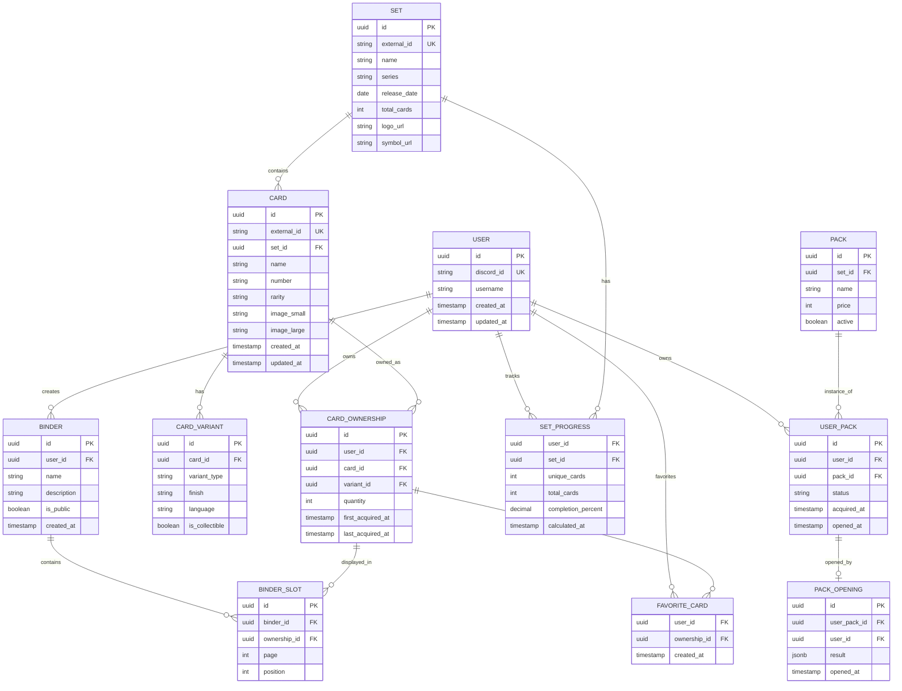

# PACK OPENING ARCHITECTURE

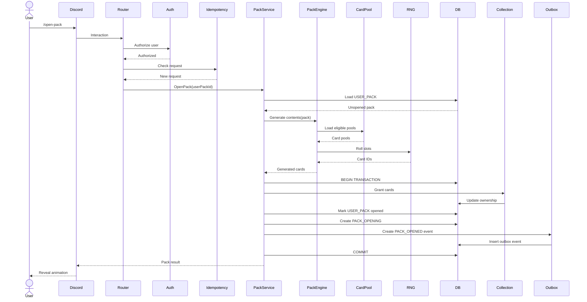

# PACK ENGINE

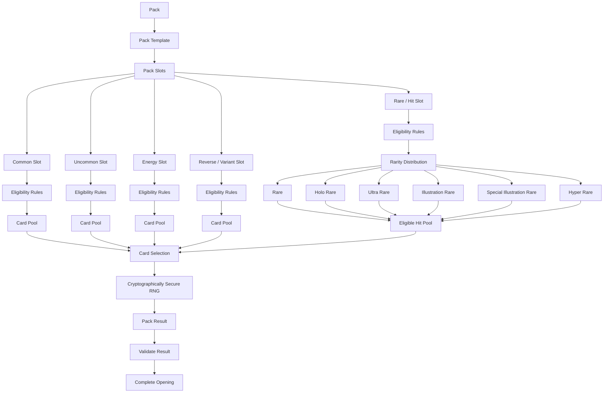

# ECONOMY ARCHITECTURE

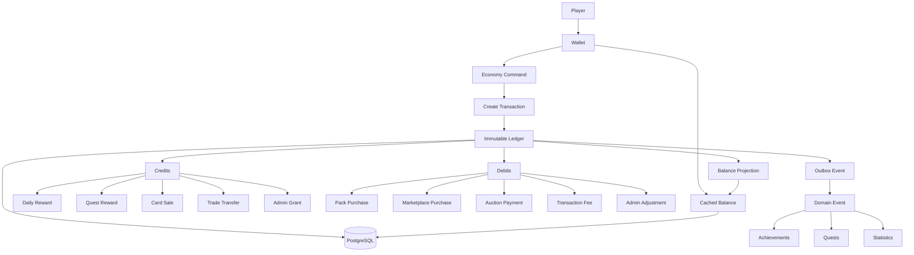

# PACK OWNERSHIP / INVENTORY

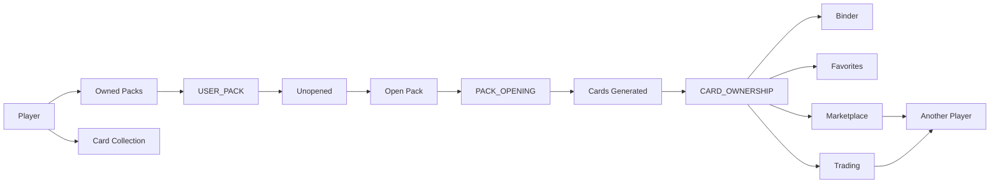

# OUTBOX + EVENT ARCHITECTURE

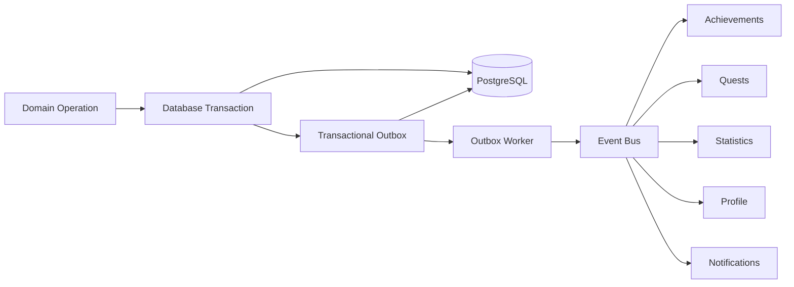

# SECURITY / REQUEST HANDLING

```mermaid
flowchart LR

    DISCORD["Discord Interaction"]

    PARSE["Parse Input"]

    AUTH["Authorization"]

    RATE["Rate Limit / Cooldown"]

    IDEMPOTENCY["Idempotency Check"]

    VALIDATE["Business Validation"]

    USECASE["Execute Use Case"]

    TRANSACTION["Database Transaction"]

    RESULT["Response"]

    DISCORD --> PARSE
    PARSE --> AUTH
    AUTH --> RATE
    RATE --> IDEMPOTENCY
    IDEMPOTENCY --> VALIDATE
    VALIDATE --> USECASE
    USECASE --> TRANSACTION
    TRANSACTION --> RESULT
    RESULT --> DISCORD
```

# MARKETPLACE + TRADING

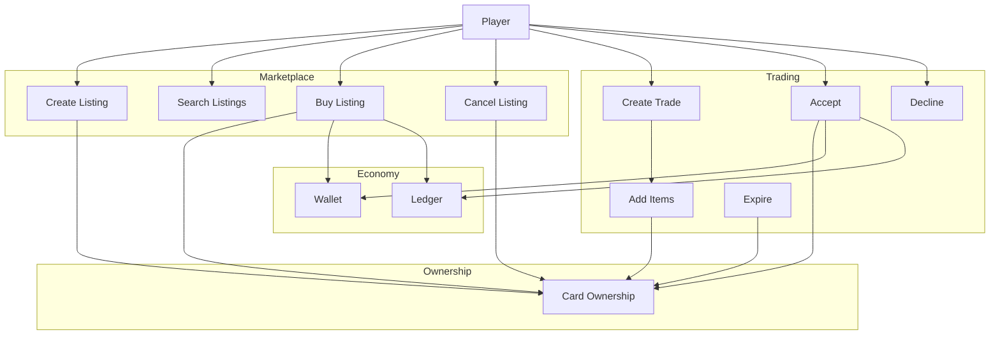

# EXTERNAL Pokémon DATA PIPELINE

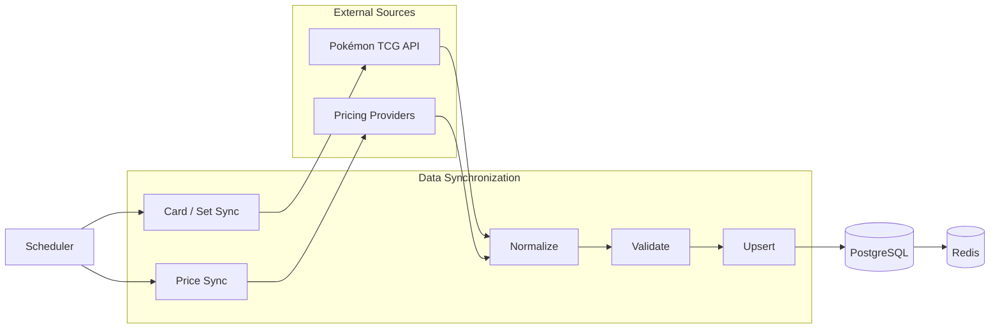

# DATA FLOW

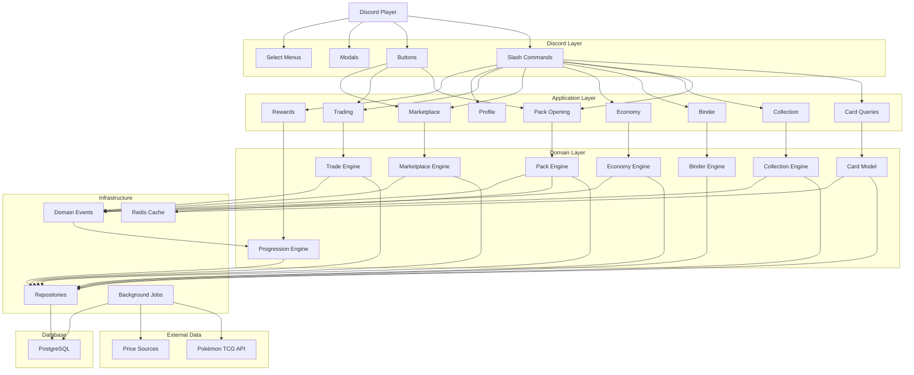

# EVENT-DRIVEN PROGRESSION

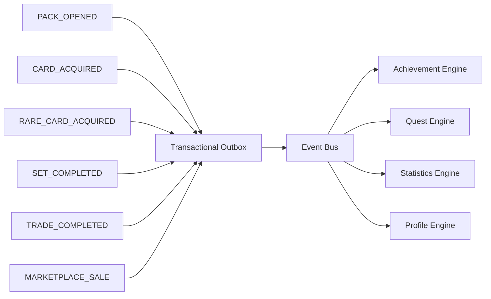

# FINAL ARCHITECTURE DESIGN

```mermaid
flowchart TB

    %% =========================================
    %% DISCORD
    %% =========================================

    USER["Discord Player"]

    subgraph PRESENTATION["PRESENTATION"]
        DISCORD["Discord Bot"]
        COMMANDS["Commands"]
        COMPONENTS["Buttons / Menus / Modals"]
    end

    USER --> DISCORD

    DISCORD --> COMMANDS
    DISCORD --> COMPONENTS

    %% =========================================
    %% APPLICATION
    %% =========================================

    subgraph APPLICATION["APPLICATION LAYER"]

        SECURITY["Authorization / Rate Limits / Idempotency"]

        USECASES["Use Cases"]

        CARD_UC["Cards"]
        PACK_UC["Packs"]
        COLLECTION_UC["Collection"]
        BINDER_UC["Binder"]
        ECONOMY_UC["Economy"]
        MARKET_UC["Marketplace"]
        TRADE_UC["Trading"]
        PROGRESSION_UC["Progression"]
    end

    COMMANDS --> SECURITY
    COMPONENTS --> SECURITY

    SECURITY --> USECASES

    USECASES --> CARD_UC
    USECASES --> PACK_UC
    USECASES --> COLLECTION_UC
    USECASES --> BINDER_UC
    USECASES --> ECONOMY_UC
    USECASES --> MARKET_UC
    USECASES --> TRADE_UC
    USECASES --> PROGRESSION_UC

    %% =========================================
    %% DOMAIN
    %% =========================================

    subgraph DOMAIN["DOMAIN LAYER"]

        CARD["Card Domain"]
        PACK["Pack Domain"]
        COLLECTION["Collection Domain"]
        BINDER["Binder Domain"]
        ECONOMY["Economy Domain"]
        MARKET["Marketplace Domain"]
        TRADE["Trading Domain"]
        PROGRESSION["Progression Domain"]

        RNG["Secure RNG"]
        OWNERSHIP["Ownership Rules"]
        LEDGER["Transaction Rules"]
    end

    CARD_UC --> CARD
    PACK_UC --> PACK
    COLLECTION_UC --> COLLECTION
    BINDER_UC --> BINDER
    ECONOMY_UC --> ECONOMY
    MARKET_UC --> MARKET
    TRADE_UC --> TRADE
    PROGRESSION_UC --> PROGRESSION

    PACK --> RNG
    COLLECTION --> OWNERSHIP
    BINDER --> OWNERSHIP
    ECONOMY --> LEDGER
    MARKET --> LEDGER
    TRADE --> LEDGER

    %% =========================================
    %% PORTS
    %% =========================================

    subgraph PORTS["DOMAIN PORTS"]

        REPOSITORIES["Repository Interfaces"]
        EVENTS["Event Publisher"]
        CLOCK["Clock / Time"]
    end

    CARD --> REPOSITORIES
    PACK --> REPOSITORIES
    COLLECTION --> REPOSITORIES
    BINDER --> REPOSITORIES
    ECONOMY --> REPOSITORIES
    MARKET --> REPOSITORIES
    TRADE --> REPOSITORIES
    PROGRESSION --> REPOSITORIES

    PACK --> EVENTS
    COLLECTION --> EVENTS
    ECONOMY --> EVENTS
    MARKET --> EVENTS
    TRADE --> EVENTS

    %% =========================================
    %% INFRASTRUCTURE
    %% =========================================

    subgraph INFRA["INFRASTRUCTURE"]

        DB[(PostgreSQL)]
        CACHE[(Redis)]

        OUTBOX["Transactional Outbox"]
        OUTBOX_WORKER["Outbox Worker"]
        EVENT_BUS["Event Bus"]

        CARD_SYNC["Card / Set Sync Worker"]
        PRICE_SYNC["Price Sync Worker"]

        API["Pokémon TCG API Client"]
        PRICES["Pricing Provider Client"]

        STORAGE["Object Storage / CDN"]
        OBS["Logging / Metrics / Tracing"]
    end

    REPOSITORIES -. implemented by .-> DB
    REPOSITORIES -. cached through .-> CACHE

    EVENTS -. implemented by .-> OUTBOX

    %% =========================================
    %% EVENT PIPELINE
    %% =========================================

    OUTBOX --> OUTBOX_WORKER
    OUTBOX_WORKER --> EVENT_BUS
    EVENT_BUS --> PROGRESS["Achievements / Quests / Stats"]

    %% =========================================
    %% DATA SYNC
    %% =========================================

    CARD_SYNC --> API
    PRICE_SYNC --> PRICES

    API --> TCG["Pokémon TCG API"]
    PRICES --> PRICE["Price Providers"]

    CARD_SYNC --> DB
    PRICE_SYNC --> DB

    %% =========================================
    %% STORAGE
    %% =========================================

    CARD --> STORAGE

    %% =========================================
    %% OBSERVABILITY
    %% =========================================

    DISCORD --> OBS
    OUTBOX_WORKER --> OBS
    CARD_SYNC --> OBS
    PRICE_SYNC --> OBS
    DB --> OBS
```
