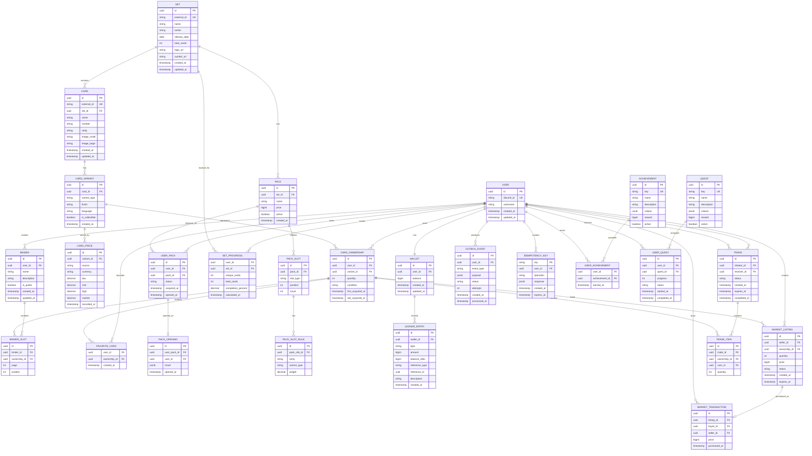

```mermaid
erDiagram

    %% =========================================================
    %% USERS
    %% =========================================================

    USER ||--|| WALLET : has

    %% =========================================================
    %% POKEMON TCG DATA
    %% =========================================================

    SET ||--o{ CARD : contains
    CARD ||--o{ CARD_VARIANT : has
    CARD_VARIANT ||--o{ CARD_PRICE : priced_by

    %% =========================================================
    %% COLLECTION
    %% =========================================================

    USER ||--o{ CARD_OWNERSHIP : owns
    CARD_VARIANT ||--o{ CARD_OWNERSHIP : represents

    USER ||--o{ BINDER : creates
    BINDER ||--o{ BINDER_SLOT : contains
    CARD_OWNERSHIP ||--o{ BINDER_SLOT : displayed_as

    USER ||--o{ FAVORITE_CARD : favorites
    CARD_OWNERSHIP ||--o{ FAVORITE_CARD : marked

    USER ||--o{ SET_PROGRESS : tracks
    SET ||--o{ SET_PROGRESS : tracked_for

    %% =========================================================
    %% PACKS
    %% =========================================================

    SET ||--o{ PACK : has
    PACK ||--o{ PACK_SLOT : defines

    USER ||--o{ USER_PACK : owns
    PACK ||--o{ USER_PACK : instance_of

    USER_PACK ||--o| PACK_OPENING : opened_as

    PACK_SLOT ||--o{ PACK_SLOT_RULE : has

    %% =========================================================
    %% ECONOMY
    %% =========================================================

    WALLET ||--o{ LEDGER_ENTRY : records

    %% =========================================================
    %% MARKETPLACE
    %% =========================================================

    USER ||--o{ MARKET_LISTING : creates
    CARD_OWNERSHIP ||--o{ MARKET_LISTING : listed

    MARKET_LISTING ||--o| MARKET_TRANSACTION : purchased_as
    USER ||--o{ MARKET_TRANSACTION : buys

    %% =========================================================
    %% TRADING
    %% =========================================================

    USER ||--o{ TRADE : initiates
    USER ||--o{ TRADE : receives

    TRADE ||--o{ TRADE_ITEM : contains
    CARD_OWNERSHIP ||--o{ TRADE_ITEM : offered

    %% =========================================================
    %% EVENTS
    %% =========================================================

    USER ||--o{ OUTBOX_EVENT : produces
    USER ||--o{ IDEMPOTENCY_KEY : creates

    %% =========================================================
    %% PROGRESSION
    %% =========================================================

    ACHIEVEMENT ||--o{ USER_ACHIEVEMENT : awarded
    USER ||--o{ USER_ACHIEVEMENT : earns

    QUEST ||--o{ USER_QUEST : assigned
    USER ||--o{ USER_QUEST : receives


    %% =========================================================
    %% ENTITIES
    %% =========================================================

    USER {
        uuid id PK
        string discord_id UK
        string username
        timestamp created_at
        timestamp updated_at
    }

    SET {
        uuid id PK
        string external_id UK
        string name
        string series
        date release_date
        int total_cards
        string logo_url
        string symbol_url
        timestamp created_at
        timestamp updated_at
    }

    CARD {
        uuid id PK
        string external_id UK
        uuid set_id FK
        string name
        string number
        string rarity
        string image_small
        string image_large
        timestamp created_at
        timestamp updated_at
    }

    CARD_VARIANT {
        uuid id PK
        uuid card_id FK
        string variant_type
        string finish
        string language
        boolean is_collectible
        timestamp created_at
    }

    CARD_OWNERSHIP {
        uuid id PK
        uuid user_id FK
        uuid variant_id FK
        int quantity
        string condition
        timestamp first_acquired_at
        timestamp last_acquired_at
    }

    BINDER {
        uuid id PK
        uuid user_id FK
        string name
        string description
        boolean is_public
        timestamp created_at
        timestamp updated_at
    }

    BINDER_SLOT {
        uuid id PK
        uuid binder_id FK
        uuid ownership_id FK
        int page
        int position
    }

    FAVORITE_CARD {
        uuid user_id FK
        uuid ownership_id FK
        timestamp created_at
    }

    SET_PROGRESS {
        uuid user_id FK
        uuid set_id FK
        int unique_cards
        int total_cards
        decimal completion_percent
        timestamp calculated_at
    }

    PACK {
        uuid id PK
        uuid set_id FK
        string name
        bigint price
        boolean active
        timestamp created_at
    }

    PACK_SLOT {
        uuid id PK
        uuid pack_id FK
        string slot_type
        int position
        int count
    }

    PACK_SLOT_RULE {
        uuid id PK
        uuid pack_slot_id FK
        string rarity
        string variant_type
        decimal weight
    }

    CARD_PRICE {
        uuid id PK
        uuid variant_id FK
        string source
        string currency
        decimal low
        decimal mid
        decimal high
        decimal market
        timestamp recorded_at
    }

    USER_PACK {
        uuid id PK
        uuid user_id FK
        uuid pack_id FK
        string status
        timestamp acquired_at
        timestamp opened_at
    }

    PACK_OPENING {
        uuid id PK
        uuid user_pack_id FK
        uuid user_id FK
        jsonb result
        timestamp opened_at
    }

    WALLET {
        uuid id PK
        uuid user_id FK
        bigint balance
        timestamp created_at
        timestamp updated_at
    }

    LEDGER_ENTRY {
        uuid id PK
        uuid wallet_id FK
        string type
        bigint amount
        bigint balance_after
        string reference_type
        uuid reference_id
        string description
        timestamp created_at
    }

    MARKET_LISTING {
        uuid id PK
        uuid seller_id FK
        uuid ownership_id FK
        int quantity
        bigint price
        string status
        timestamp created_at
        timestamp expires_at
    }

    MARKET_TRANSACTION {
        uuid id PK
        uuid listing_id FK
        uuid buyer_id FK
        uuid seller_id FK
        bigint price
        timestamp purchased_at
    }

    TRADE {
        uuid id PK
        uuid initiator_id FK
        uuid receiver_id FK
        string status
        timestamp created_at
        timestamp expires_at
        timestamp completed_at
    }

    TRADE_ITEM {
        uuid id PK
        uuid trade_id FK
        uuid ownership_id FK
        uuid user_id FK
        int quantity
    }

    OUTBOX_EVENT {
        uuid id PK
        uuid user_id FK
        string event_type
        jsonb payload
        string status
        int attempts
        timestamp created_at
        timestamp processed_at
    }

    IDEMPOTENCY_KEY {
        string key PK
        uuid user_id FK
        string operation
        jsonb response
        timestamp created_at
        timestamp expires_at
    }

    ACHIEVEMENT {
        uuid id PK
        string key UK
        string name
        string description
        jsonb criteria
        bigint reward
        boolean active
    }

    USER_ACHIEVEMENT {
        uuid user_id FK
        uuid achievement_id FK
        timestamp earned_at
    }

    QUEST {
        uuid id PK
        string key UK
        string name
        string description
        jsonb criteria
        bigint reward
        boolean active
    }

    USER_QUEST {
        uuid id PK
        uuid user_id FK
        uuid quest_id FK
        int progress
        string status
        timestamp started_at
        timestamp completed_at
    }
```
